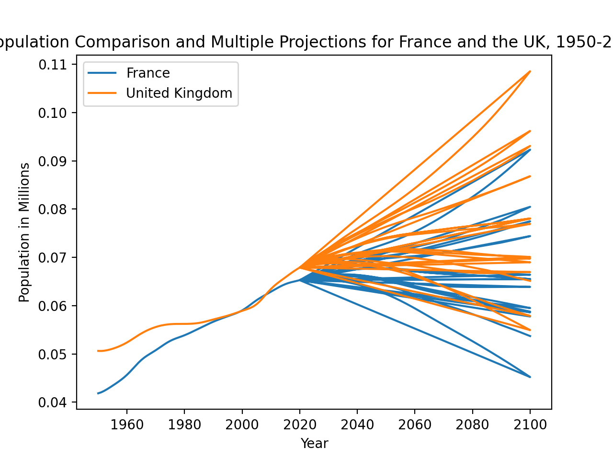
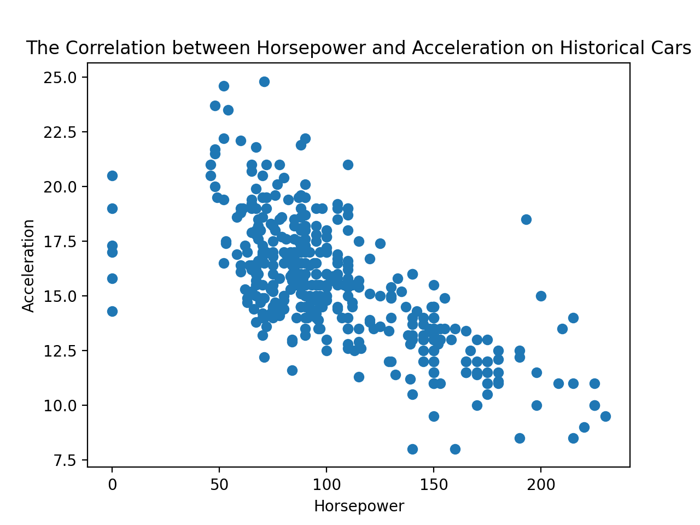

# CSCI040 Homework #02

## Plot #1: Comparing Historical Population Trends and Many Projections for France and the United Kingdom 

This is a line graph. In this graph, I plotted population data for France and the United Kingdom from 1950-2019, and also included many different projections for 2020-2100 -- thus the many lines on the right side of the graph. The x-axis is the year, and the y-axis is population in millions of people. I sourced this data from [the United Nations](http://data.un.org/)!

## Plot #2: Comparing Horsepower and Acceleration in Historical Cars

This is a scatter plot. In this plot, I attempted to show a potential correlation between horsepower and acceleration in historical cars. The x-axis shows the horsepower, and the y-axis shows acceleration. This data was sourced from [here](https://perso.telecom-paristech.fr/eagan/class/igr204/datasets), so feel free to check them out! I just googled "Easy CSV Datasets," and there they were! They are amazing!

If you want to know why I did this, it was for a project for my CSCI040 course, linked [here](https://github.com/mikeizbicki/cmc-csci040/tree/2020fall/hw_02)!